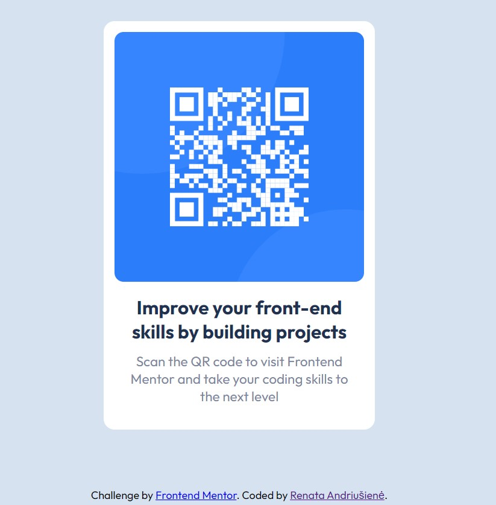

# Frontend Mentor - QR code component solution

This is a solution to the [QR code component challenge on Frontend Mentor](https://www.frontendmentor.io/challenges/qr-code-component-iux_sIO_H).

## Table of contents

- [Screenshot](#screenshot)
- [Links](#links)
  - [Built with](#built-with)
  - [Useful resources](#useful-resources)
- [Author](#author)

**Note: Delete this note and update the table of contents based on what sections you keep.**

### Screenshot

### Links

- Solution URL: [https://github.com/An-Renata/qr-code-component-main]
- Live Site URL: [https://transcendent-donut-355685.netlify.app/]

### Built with

- Semantic HTML5 markup
- CSS custom properties
- Flexbox

### Useful resources

- [https://css-tricks.com/snippets/css/a-guide-to-flexbox/](https://www.example.com) - Best flexbox guide when you need to remember some concepts

## Author

- Website - [Renata Andriušienė]
- Frontend Mentor - [@An-Renata](https://www.frontendmentor.io/profile/An-Renata)
